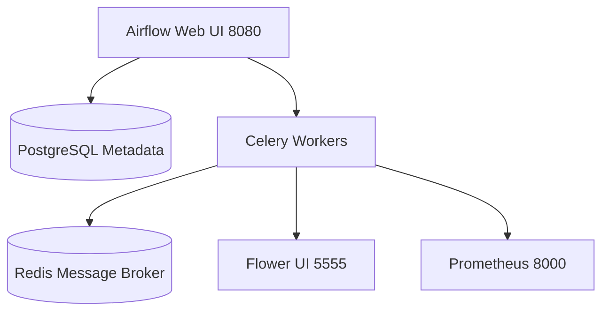

# 🏙 Hướng Dẫn Triển Khai Hanoi Smart Tourism Data Lakehouse Platform

**Deployment & Operations Guide**
*Phiên bản 1.0 — Năm 2025*

| Thông tin | Chi tiết |
| :--- | :--- |
| **Dự án** | Hanoi Smart Tourism Data Lakehouse Platform |
| **Phiên bản** | 1.0 (Production Ready) |
| **Đối tượng** | Kỹ sư hạ tầng, DevOps, Data Engineer |
| **Môi trường** | Linux Ubuntu 22.04 LTS / Docker Compose |

---

## 1. Yêu Cầu Tiên Quyết

Trước khi bắt đầu quá trình cài đặt, đảm bảo máy chủ đáp ứng đầy đủ các yêu cầu dưới đây.

### 1.1 Yêu Cầu Phần Cứng

| Thành phần | Tối thiểu | Khuyến nghị |
| :--- | :--- | :--- |
| **CPU** | 8 cores | 16 cores (Intel Xeon / AMD EPYC) |
| **RAM** | 32 GB | 64 GB ECC DDR4 |
| **HDD hệ thống** | 100 GB SSD | 200 GB NVMe SSD |
| **HDD dữ liệu** | 500 GB | 2 TB NVMe (MinIO Data) |
| **Đường truyền** | 100 Mbps | 1 Gbps Ethernet |

### 1.2 Yêu Cầu Phần Mềm

- **Docker**: Docker Engine ≥ 24.0
- **Compose**: Docker Compose Plugin ≥ 2.20
- **Git**: Git ≥ 2.40
- **Python**: Python 3.11+ (cho script quản trị)
- **Make**: GNU Make (tùy chọn — dùng Makefile wrapper)

### 1.3 Cổng Mạng Cần Mở

| Cổng | Dịch vụ | Ghi chú |
| :--- | :--- | :--- |
| 8080 | Apache Airflow Webserver | Quản lý DAG, giám sát pipeline |
| 5555 | Flower (Celery Monitor) | Giám sát Celery workers và tasks |
| 8001 | Airflow Prometheus Metrics | Export metrics cho monitoring |
| 9001 | MinIO Console | Giao diện quản lý Object Storage |
| 8888 | Trino Coordinator | SQL Query Engine |
| 8400 | Apache Superset | Analytics Dashboard |
| 8585 | OpenMetadata UI | Data Catalog & Lineage |
| 8200 | HashiCorp Vault | Secret Management |
| 8000 | FastAPI Backend | Management Portal API |
| 3000 | Next.js Frontend | Management Portal UI |
| 5432 | PostgreSQL | Metadata DB (nội bộ — không public) |

> [!CAUTION]
> **LƯU Ý BẢO MẬT**
>
> - Không mở cổng 5432 (PostgreSQL) và 9000 (MinIO S3 API) ra internet. Chỉ cho phép truy cập nội bộ hoặc qua VPN.
> - Nên đặt Nginx Reverse Proxy + TLS/SSL trước tất cả các dịch vụ trong môi trường production.

---

## 2. Cải Tiến Airflow (Production-Ready)

Thiết lập Airflow trong dự án này đã được tối ưu hóa vượt trội so với cấu hình chính thức của OpenMetadata:

### ✨ Tính Năng Nâng Cao

- **CeleryExecutor**: Phân tán tác vụ thay vì LocalExecutor đơn luồng.
- **Flower UI**: Giám sát Celery workers tại cổng 5555.
- **Prometheus Metrics**: Export metrics cho giám sát tại cổng 8000.
- **Log Rotation**: Tự động xoay vòng logs hàng ngày, giữ 30 ngày.
- **Health Checks**: Kiểm tra sức khỏe chi tiết cho tất cả components.

### 🔍 Giám Sát & Metrics

- **Flower**: `http://localhost:5555` - Giám sát Celery workers.
- **Prometheus Metrics**: `http://localhost:8000/metrics` - Metrics cho monitoring.
- **Airflow Web UI**: `http://localhost:8080` - DAG management.

### 📊 Components

- `airflow-api-server`: Web UI và API (Thay thế cho webserver truyền thống).
- `airflow-scheduler`: Lên lịch và trigger DAG.
- `airflow-dag-processor`: Xử lý định nghĩa DAG tách biệt để tối ưu hiệu năng.
- `airflow-triggerer`: Xử lý deferred tasks.
- `airflow-flower`: Giám sát Celery (nếu dùng) hoặc stats (tùy chọn).
- `airflow-metrics`: Export Prometheus metrics.
- `airflow-logrotate`: Quản lý xoay vòng logs.

### 🏗️ Kiến Trúc



---

## 3. Cài Đặt Môi Trường

### 3.1 Clone Repository

Tải mã nguồn dự án về máy chủ:

```bash
# Clone repository
git clone https://github.com/your-org/hanoi-tourism-lakehouse.git
cd hanoi-tourism-lakehouse

# Kiem tra cau truc thu muc
ls -la
```

### Cấu Trúc Thư Mục Dự Án (Thực Tế)

```text
hanoi-tourism-lakehouse/
│
├── apps/                              # Ứng dụng frontend & backend
│   ├── backend/                       # FastAPI Backend (Management Portal API)
│   └── frontend/                      # Next.js Frontend (Management Portal UI)
│
├── data/                              # Dữ liệu mẫu / seed data
│
├── dataplatform-extensions/           # Extensions cho nền tảng dữ liệu
│
├── docs/                              # Tài liệu dự án tiêu chuẩn
│   ├── 01_PROJECT_OVERVIEW.md         # Tổng quan và Chiến lược
│   ├── 02_ARCHITECTURE_DESIGN.md      # Kiến trúc Medallion & Stack
│   ├── 03_DATA_DICTIONARY.md          # Từ điển Dữ liệu & Lineage
│   ├── 04_DASHBOARD_SPECIFICATION.md  # Đặc tả KPIs & Superset
│   ├── 05_API_SPECIFICATION.md        # Đặc tả Endpoints
│   ├── 06_OPERATIONS_GUIDE.md         # Hướng dẫn Vận hành & Setup
│   ├── 07_SECURITY_CREDENTIALS.md     # Bảo mật, Cổng & Vault
│   ├── 08_DATA_LINEAGE_PROCESSING.md  # Luồng Dữ liệu & Xử lý Chi tiết
│   └── 09_PROJECT_COMPLETION_SNAPSHOT.md # Báo cáo Dữ liệu Thực tế
│
├── flink-rocksdb/                     # Cấu hình Flink + RocksDB state backend
│
├── infra/                             # Hạ tầng Docker Compose
│   ├── airflow/                       # Apache Airflow
│   │   ├── Dockerfile
│   │   ├── dags/                      # DAG definitions
│   │   ├── requirements.txt
│   │   └── vault-entrypoint.sh
│   ├── spark/                         # Apache Spark
│   ├── trino/                         # Trino Query Engine
│   ├── superset/                      # Apache Superset
│   ├── openmetadata/                  # OpenMetadata
│   ├── minio/                         # MinIO Object Storage
│   ├── vault/                         # HashiCorp Vault
│   ├── postgres/                      # PostgreSQL
│   ├── kafka/                         # Apache Kafka
│   └── flink/                         # Apache Flink
│
├── scripts/                           # Automation scripts
│
├── tests/                             # Test suites
│
├── .env.example                       # Template biến môi trường
├── docker-compose.yml                 # Định nghĩa tất cả services
├── docker-compose.airflow-docker-exec.yml  # Cấu hình Airflow Docker executor
├── manage_infra.ps1                   # Script quản lý (Windows PowerShell)
├── manage_infra.sh                    # Script quản lý (Linux/macOS Bash)
└── README.md                          # Tài liệu tổng quan
```

> [!NOTE]
> **GHI CHÚ VỀ CẤU TRÚC**
>
> - Toàn bộ cấu hình hạ tầng nằm trong thư mục `infra/` được tổ chức riêng theo từng service.
> - Ứng dụng portal (Backend + Frontend) được đặt trong `apps/` tách biệt khỏi hạ tầng.
> - Script quản lý hạ tầng có 2 phiên bản: `manage_infra.sh` (Linux) và `manage_infra.ps1` (Windows).

### 3.2 Cấu Hình Biến Môi Trường

Sao chép file template và điền các giá trị thực tế:

```bash
cp .env.example .env
nano .env
```

Nội dung file `.env` cần cấu hình:

```bash
# DATABASE
POSTGRES_USER=lakehouse_admin
POSTGRES_PASSWORD=<mat_khau_manh>
POSTGRES_DB=lakehouse_meta

# MINIO OBJECT STORAGE
MINIO_ROOT_USER=minio_admin
MINIO_ROOT_PASSWORD=<mat_khau_minio>
MINIO_BUCKET_BRONZE=tourism-bronze
MINIO_BUCKET_SILVER=tourism-silver
MINIO_BUCKET_GOLD=tourism-gold

# AIRFLOW
AIRFLOW_WEBSERVER_SECRET_KEY=<secret_key_ngau_nhien>
AIRFLOW_ADMIN_USER=admin
AIRFLOW_ADMIN_PASSWORD=<mat_khau_airflow>

# API KEYS (se chuyen vao Vault sau)
GOOGLE_PLACES_API_KEY=<google_api_key>
TRIPADVISOR_API_KEY=<tripadvisor_key>

# HASHICORP VAULT
VAULT_DEV_ROOT_TOKEN_ID=<vault_root_token>
```

> [!TIP]
> **THỰC HÀNH TỐT NHẤT**
>
> - Không bao giờ commit file `.env` vào Git. File `.gitignore` đã cấu hình bỏ qua `.env` theo mặc định.
> - Trong production, sử dụng HashiCorp Vault (Mục 6) để quản lý tập trung toàn bộ secrets.

### 3.3 Khởi Động Stack Lần Đầu

Thực hiện các bước theo đúng thứ tự sau đây:

### Bước 1 — Khởi động hạ tầng cốt lõi

```bash
# Khoi dong PostgreSQL, MinIO, Vault truoc tien
docker compose up -d postgres minio vault

# Cho services healthy (khoang 30 giay)
docker compose ps
```

### Bước 2 — Khởi tạo MinIO Buckets

```bash
# Chay script khoi tao bucket tu dong
docker compose run --rm minio-init

# Hoac tao thu cong qua MinIO Client (mc)
docker compose exec minio mc alias set local \
  http://localhost:9000 $MINIO_ROOT_USER $MINIO_ROOT_PASSWORD

docker compose exec minio mc mb local/tourism-bronze
docker compose exec minio mc mb local/tourism-silver
docker compose exec minio mc mb local/tourism-gold
```

### Bước 3 — Khởi tạo HashiCorp Vault

```bash
# Init Vault va lay Unseal Keys
docker compose exec vault vault operator init

# LƯU LẠI Unseal Keys và Root Token an toàn!

# Chay script cau hinh tu dong
bash scripts/setup_vault.sh

# Nap API keys vao Vault
docker compose exec vault vault kv put secret/tourism/apis \
  google_places_key='<YOUR_KEY>' \
  tripadvisor_key='<YOUR_KEY>'
```

### Bước 4 — Khởi động Apache Airflow

## 🚀 Đóng gói & Triển khai Production

Dự án hiện đã được cấu hình để đóng gói hoàn chỉnh (Baking) thay vì phụ thuộc vào ổ đĩa ngoài (Volumes).

### 1. Đóng gói dự án

Sử dụng Makefile để xây dựng toàn bộ các Image đã được tối ưu hóa:

```bash
make build
```

Lệnh này sẽ:

- Nhúng DAGs và dbt project trực tiếp vào Airflow Image.
- Build Backend ở chế độ Production (4 workers, no reload).
- Build Frontend ở chế độ Standalone.

### 2. Khởi tạo môi trường

Nếu chạy lần đầu hoặc trên môi trường mới:

```bash
make init
```

Lệnh này sẽ tự động khởi tạo MinIO Buckets, Database Migration và Vault.

### 3. Vận hành

- Chạy hệ thống: `make up`
- Dừng hệ thống: `make down`
- Xem log: `make logs s=airflow-worker`
- Kiểm tra trạng thái: `make status`

```bash
# Khoi tao database Airflow
docker compose run --rm airflow-init

# Khoi dong tat ca Airflow components
docker compose up -d airflow-api-server airflow-scheduler \
  airflow-dag-processor airflow-triggerer airflow-flower \
  airflow-metrics airflow-logrotate

# Kiem tra logs
docker compose logs -f airflow-api-server
```

*Truy cập các giao diện:*

- Airflow Web UI: `http://localhost:8080`
- Flower (Celery monitoring): `http://localhost:5555`
- Prometheus Metrics: `http://localhost:8001/metrics`

### Bước 5 — Khởi động Query Engine và Analytics

```bash
# Khoi dong Trino va Superset
docker compose up -d trino
docker compose up -d superset
docker compose exec superset superset init

# Khoi dong OpenMetadata
docker compose up -d openmetadata-server
```

### Bước 6 — Khởi động Management Portal

```bash
# Khoi dong Backend FastAPI
docker compose up -d backend

# Khoi dong Frontend Next.js
docker compose up -d frontend
```

> [!IMPORTANT]
> **KIỂM TRA SAU KHI HOÀN THÀNH**
> Sau khi hoàn thành Bước 6, tất cả container phải ở trạng thái healthy hoặc running.
> Chạy lệnh sau để kiểm tra nhanh:
> `docker compose ps | grep -v 'Up\|healthy' | grep -v NAME`

---

## 4. Thiết Lập Apache Iceberg Tables

### 4.1 Kết Nối Trino với Iceberg Catalog

```bash
# Ket noi Trino CLI
docker compose exec trino trino --server localhost:8888 \
  --catalog iceberg --schema bronze

# Trong Trino shell
SHOW CATALOGS;
SHOW SCHEMAS FROM iceberg;
```

### 4.2 Khởi Tạo Cấu Trúc Medallion (Bronze → Silver → Gold)

```bash
# Chay script DDL khoi tao Iceberg tables
bash scripts/init_iceberg_tables.sh
```

**DDL mẫu cho bảng Silver chính:**

```sql
CREATE TABLE IF NOT EXISTS iceberg.silver.attractions_enriched (
  osm_id              VARCHAR,
  name                VARCHAR,
  address             VARCHAR,
  latitude            DOUBLE,
  longitude           DOUBLE,
  rating              DOUBLE,
  review_count        INTEGER,
  run_id              VARCHAR,
  snapshot_date       VARCHAR,
  source_ingested_at  TIMESTAMP(6),
  silver_processed_at TIMESTAMP(6),
  business_key        VARCHAR
)
WITH (
  format       = 'PARQUET',
  location     = 's3a://tourism-silver/attractions_enriched/'
);
```

### 4.3 Cấu Hình Compaction Job

Compaction Job chạy tự động hàng đêm, nén các file nhỏ, tăng 40% tốc độ truy vấn Trino:

```bash
# Kich hoat thu cong Compaction DAG
docker compose exec airflow-api-server airflow dags trigger \
  iceberg_maintenance_dag
```

> [!NOTE]
> DAG này chạy tự động lúc 02:00 AM hàng ngày và thực hiện: `rewrite_data_files` + `expire_snapshots`.

---

## 5. Cấu Hình Data Pipeline

### 5.1 Đăng Ký Nguồn Dữ Liệu

Truy cập Management Portal tại `http://<server-ip>:3000`:

1. Vào menu **Ingestion** → **Add Source**.
2. Chọn loại nguồn: **Google Places API** / **Tripadvisor API** / **OpenStreetMap**.
3. Nhập tham số cấu hình (khu vực địa lý, danh mục, tần suất cập nhật).
4. Nhấn **Test Connection** để kiểm tra kết nối API.
5. Lưu cấu hình — hệ thống tự động tạo DAG tương ứng trong Airflow.

### 5.2 Lịch Chạy Pipeline (Schedule)

| DAG | Lịch chạy | Mô tả |
| :--- | :--- | :--- |
| `bronze_ingest_osm_google_enriched` | `0 2 * * *` | Luồng ingest chính: OSM → Google enrichment → raw JSON landing |
| `silver_transform_enriched_data` | `0 5 * * *` | Chuẩn hóa và khử trùng lặp vào Silver |
| `gold_transform_tourism_marts` | `0 6 * * *` | Cập nhật các mart analytics Gold |
| `iceberg_maintenance_dag` | `0 2 * * *` | Compaction + Snapshot cleanup lúc 02:00 |
| `master_pipeline_hanoi_tourism` | Manual | Orchestration one-click cho đúng luồng chính |

---

## 6. Quản Lý Secrets với HashiCorp Vault

### 6.1 Cấu Hình Vault Policies

```bash
# Tao policy cho Airflow (chi doc secrets)
vault policy write airflow-policy - <<EOF
path "secret/data/tourism/*" {
  capabilities = ["read"]
}
EOF

# Tao AppRole cho Airflow
vault auth enable approle
vault write auth/approle/role/airflow \
  token_policies="airflow-policy" \
  token_ttl=1h token_max_ttl=4h
```

### 6.2 Nạp Secrets Vào Vault

```bash
# Nap Google Places API Key
vault kv put secret/tourism/apis \
  google_places_key='AIza...' \
  tripadvisor_key='abc123...'

# Nap database credentials
vault kv put secret/db/postgres \
  host='postgres' port='5432' \
  user='lakehouse_admin' password='<strong_pw>'

# Nap MinIO credentials
vault kv put secret/storage/minio \
  access_key='minio_admin' secret_key='<strong_pw>'
```

---

## 7. Cấu Hình Analytics Dashboard

### 7.1 Kết Nối Superset với Trino

Truy cập Apache Superset tại `http://<server-ip>:8400` (admin/admin mặc định — đổi ngay sau khi đăng nhập):

1. Vào **Settings** → **Database Connections** → **+ Database**.
2. Chọn loại: **Trino**.
3. Nhập Connection String: `trino://trino@trino:8080/iceberg`
4. Nhấn **Test Connection** → nếu thành công, nhấn **Save**.
5. Truy cập SQL Lab để kiểm tra truy vấn.

### 7.2 Import Dashboard Mẫu

```bash
# Import dashboards mau vao Superset
docker compose exec superset superset import-dashboards \
  -p /app/dashboards/hanoi_tourism_dashboards.zip \
  --username admin
```

**Các dashboards được import:**

1. Tổng quan mật độ điểm du lịch Hà Nội (Bản đồ).
2. Phân tích xu hướng rating theo quận/huyện.
3. Cảnh báo nguy cơ quá tải (Overcrowding Alert).
4. Top điểm du lịch theo số lượng đánh giá.

---

## 8. Cấu Hình OpenMetadata

### 8.1 Kết Nối Data Sources

Truy cập OpenMetadata tại `http://<server-ip>:8585` (`admin@open-metadata.org` / `admin`):

1. **Settings** → **Services** → **+ Add Service**.
2. Chọn **Database** → **Trino**. Nhập thông tin kết nối (host: `trino`, port: `8080`).
3. Bật **Data Profiling** và **Lineage Ingestion**.
4. Lên lịch **Metadata Ingestion**: hàng ngày lúc 13:00.

### 8.2 Cấu Hình OpenLineage Spark Listener

Thêm vào `infra/spark/config/spark_defaults.conf`:

```text
spark.extraListeners=io.openlineage.spark.agent.OpenLineageSparkListener
spark.openlineage.transport.type=http
spark.openlineage.transport.url=http://openmetadata-server:8080
spark.openlineage.transport.endpoint=/api/v1/lineage
spark.openlineage.namespace=hanoi-tourism-lakehouse
```

 Hướng dẫn truy cập Data Lineage trên OpenMetadata
Bước 1: Đăng nhập hệ thống
Địa chỉ: <http://localhost:8585>
Tài khoản đăng nhập (Mặc định):
Email: <admin@open-metadata.org>
Mật khẩu: admin
Bước 2: Tìm kiếm dữ liệu "Vàng"
Sau khi đăng nhập, tại thanh tìm kiếm ở chính giữa trang đầu tiên:

Gõ từ khóa: gold_attractions.
Chọn bảng dữ liệu thuộc dịch vụ trino_lakehouse (hoặc iceberg).
Bước 3: Truy cập tab Lineage
Tại trang chi tiết của bảng gold_attractions, bạn sẽ thấy các tab thông tin (Schema, Queries, Profiler, Lineage...).

Hãy nhấp chuột vào tab Lineage.
Lúc này, một sơ đồ dạng nút (Node) sẽ hiện ra.
Bước 4: Khám phá dòng chảy dữ liệu
Trong sơ đồ Lineage, bạn sẽ thấy các kết nối trực quan:

Nút bên trái (Bronze): source=osm_google_enriched (Dữ liệu thô từ API).
Nút ở giữa (Silver): attractions_enriched (Dữ liệu đã qua Spark xử lý làm sạch).
Nút bên phải (Gold): gold_attractions (Bảng bảng cuối cùng chia theo 30 Quận/Huyện).

---

## 9. Kiểm Tra Toàn Diện Hệ Thống

### 9.1 Checklist Sau Triển Khai

| # | Hạng mục kiểm tra | URL / Lệnh kiểm tra |
| :--- | :--- | :--- |
| 1 | MinIO Console truy cập được, 4 buckets đã tạo | `http://<ip>:9001` |
| 2 | Airflow Webserver online, DAGs import đủ | `http://<ip>:8080` |
| 3 | Trino kết nối Iceberg thành công | `SHOW CATALOGS;` |
| 4 | Superset kết nối Trino, Dashboard load được | `http://<ip>:8400` |
| 5 | OpenMetadata hiển thị tables trong Data Catalog | `http://<ip>:8585` |
| 6 | Vault ở trạng thái unsealed | `vault status` |
| 7 | Management Portal API trả về 200 OK | `http://<ip>:8000/health` |
| 8 | Management Portal Frontend load thành công | `http://<ip>:3000` |
| 9 | Pipeline chạy end-to-end lần đầu thành công | Airflow → DAG Runs → All Success |
| 10 | Data Lineage xuất hiện trong OpenMetadata | OpenMetadata → Lineage Graph |

**Health check nhanh:**

```bash
docker compose ps
docker stats --no-stream
docker compose logs --since=1h | grep -i 'error\|exception\|fatal'
bash scripts/health_check.sh
```

---

## 10. Vận Hành và Bảo Trì

### 10.1 Backup Định Kỳ

```bash
# Backup PostgreSQL metadata database
docker compose exec postgres pg_dump \
  -U $POSTGRES_USER $POSTGRES_DB \
  | gzip > backups/metadata_$(date +%Y%m%d).sql.gz

# Sync MinIO data sang backup storage
docker compose exec minio mc mirror \
  local/ backup-storage/hanoi-tourism-backup/
```

**Crontab tự động (chạy lúc 01:00 AM hàng ngày):**
`0 1 * * * bash /opt/hanoi-lakehouse/scripts/daily_backup.sh`

### 10.2 Scaling Services

```bash
# Tang tai nguyen cho Scheduler khi co nhieu DAGs
docker compose up -d --scale airflow-scheduler=1

# Scale Trino Workers de tang throughput truy van
docker compose up -d --scale trino-worker=2
```

### 10.3 Xử Lý Sự Cố Thường Gặp

| Triệu chứng | Nguyên nhân | Giải pháp |
| :--- | :--- | :--- |
| Airflow DAG bị failed | API key hết hạn / rate limit | Kiểm tra Vault secrets, gia hạn key |
| Trino query timeout | File nhỏ chưa compact | Trigger `iceberg_maintenance_dag` |
| MinIO Out of disk | Snapshots Iceberg cũ tích lũy | Chạy `expire_snapshots` trong Trino |
| Superset chart lỗi | Gold table chưa refresh | Trigger `dbt_gold_star_schema` DAG |
| Container OOM Killed | RAM không đủ cho Spark job | Tăng RAM hoặc giảm `spark.executor.memory` |

---

## Phụ Lục: Thông Tin Tham Khảo

### A. Tài Khoản Mặc Định

> [!WARNING]
> **CẢNH BÁO BẢO MẬT**
> Đổi toàn bộ mật khẩu mặc định ngay sau khi cài đặt thành công. Không bao giờ để mật khẩu mặc định trong môi trường production.

| Dịch vụ | Username | Password | Ghi chú |
| :--- | :--- | :--- | :--- |
| Airflow API Server | `admin` | Xem `.env` | Đổi ngay sau khi vào |
| MinIO Console | `minio_admin` | Xem `.env` | S3-compatible storage |
| Apache Superset | `admin` | `admin` | ⚠️ Bắt buộc đổi ngay |
| OpenMetadata | `admin@open-metadata.org` | `admin` | ⚠️ Bắt buộc đổi ngay |
| HashiCorp Vault | Root Token | Xem init output | Lưu offline an toàn |

### B. Tài Liệu Tham Khảo

- **Airflow**: [Documentation](https://airflow.apache.org/docs/)
- **Iceberg**: [The Definitive Guide](https://iceberg.apache.org)
- **Trino**: [Documentation](https://trino.io/docs/current)
- **dbt**: [Documentation](https://docs.getdbt.com)
- **Vault**: [Documentation](https://developer.hashicorp.com/vault)
- **OpenMetadata**: [Documentation](https://docs.open-metadata.org)
- **Superset**: [Documentation](https://superset.apache.org/docs)

---

## 📞 HỖ TRỢ KỸ THUẬT

Để được hỗ trợ kỹ thuật, vui lòng liên hệ team Data Engineering qua:

- Tạo **Issue** trên GitHub repository của dự án.
- Liên hệ trực tiếp qua kênh Slack: **#hanoi-tourism-lakehouse**
- Email: [data-team@hanoi-tourism.gov.vn](mailto:data-team@hanoi-tourism.gov.vn)
