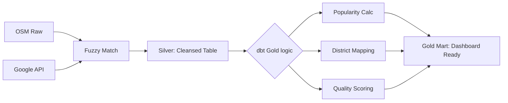

# 08. Luồng Dữ liệu & Quy trình Xử lý (Data Lineage & Processing)

Tài liệu này mô tả chi tiết nguồn gốc dữ liệu và các bước biến đổi kỹ thuật từ dữ liệu thô sang các chỉ số trên Dashboard.

## 8.1. Nguồn dữ liệu (Data Sources)

Hệ thống sử dụng chiến lược "Hợp nhất đa nguồn" (Multi-source Fusion) để tối ưu hóa độ chính xác:

1. **OpenStreetMap (OSM):**
    * *Mục đích:* Cung cấp khung danh sách các địa điểm (POIs) và hạ tầng bản đồ.
    * *Dữ liệu lấy:* Tọa độ (Lat/Lon), Tên, Loại hình (Amenities - như cafe, restaurant, museum).
    * *Phương thức:* Truy vấn qua Overpass API.

2. **Google Places API:**
    * *Mục đích:* Làm giàu dữ liệu (Enrichment) với các thông số kinh doanh thực tế.
    * *Dữ liệu lấy:* Điểm đánh giá (Rating), Tổng số lượt review (`user_ratings_total`), Địa chỉ, Website, Số điện thoại.
    * *Phương thức:* Google Places Search/Details API.

## 8.2. Quy trình Ingestion (Tầng Bronze)

* **Trigger:** Airflow DAG `bronze_ingest_hanoi_unified`.
* **Logic xử lý:**
    1. Dịch vụ backend gửi truy vấn vùng Hanoi cho OSM.
    2. Với mỗi địa điểm OSM trả về, hệ thống thực hiện "Fuzzy Matching" gọi Google API để lấy thêm dữ liệu.
    3. Lưu toàn bộ kết quả dưới dạng **JSON gốc** vào MinIO tại `s3://tourism-bronze/`.

## 8.3. Quy trình Làm sạch (Tầng Silver)

* **Công cụ:** Apache Spark.
* **Các bước xử lý:**
    1. **Phẳng hóa (Flatten):** Chuyển từ cấu trúc JSON lồng nhau sang dạng bảng.
    2. **Khử trùng (Deduplication):** Sử dụng `business_key` (tạo từ MD5 của tên và tọa độ làm tròn) để đảm bảo không có địa điểm nào bị lặp lại.
    3. **Chuẩn hóa kiểu dữ liệu:** Chuyển tọa độ sang `Double`, rating sang `Float`, ngày tháng sang `Timestamp`.
    4. **Lưu trữ:** Ghi vào bảng Iceberg `silver.attractions_enriched`.

## 8.4. Quy trình Phân tích (Tầng Gold)

* **Công cụ:** dbt (Data Build Tool) + Trino.
* **Logic chuyên sâu:**
    1. **Tính toán Độ nổi tiếng (Popularity):** Áp dụng công thức `Rating * Log10(Reviews + 1)` để tránh sai lệch của các địa điểm có rating cao nhưng ít người đánh giá.
    2. **Phân vùng địa lý:** Sử dụng logic `CASE WHEN` với tọa độ thực tế để gán địa điểm vào 30 Quận/Huyện của Hà Nội.
    3. **Phân hạng chất lượng:** Gán nhãn `High`, `Medium`, `Low` dựa trên độ tin cậy của nguồn dữ liệu.
    4. **Snapshotting:** Lưu trữ kết quả dưới dạng bảng vật lý (`table`) để Superset truy vấn với tốc độ < 1 giây.

## 8.5. Truy xuất Dashboard

1. **Apache Superset** gửi câu lệnh SQL tới **Trino**.
2. **Trino** truy cập Metadata của bảng Iceberg trong Gold layer.
3. Dữ liệu được hiển thị trên bản đồ không gian (Geo-spatial) và các đồ thị xu hướng.

## 8.6. Bảng Ánh xạ Dữ liệu Chi tiết (Field-level Mapping)

Dưới đây là bảng đặc tả chi tiết cách từng trường thông tin được hình thành:

| Trường (Gold Layer) | Nguồn Gốc (Source) | Quy trình Xử lý (Processing Logic) |
| :--- | :--- | :--- |
| `attraction_key` | OSM ID + Coordinates | Dùng hàm `MD5(to_utf8(name \|\| lat \|\| lon))` để tạo khóa định danh duy nhất không phụ thuộc vào ID hệ thống nguồn. |
| `name` | Google / OSM Name | Ưu tiên `google_data.name`, nếu trống dùng `osm_data.name`. Sau đó dùng hàm `Initcap` và `Trim` để chuẩn hóa định dạng văn bản. |
| `category` | Google Types / OSM Amenity | Lấy phần tử đầu tiên trong mảng `poi_types` từ Google. Nếu không có, ánh xạ từ bảng danh mục chuẩn của dự án. |
| `lat` / `lon` | Google / OSM Geo | Ưu tiên tọa độ chính xác cao từ Google Places. Ép kiểu về `Double`. |
| `avg_rating` | Google Rating | Lấy trực tiếp từ trường `rating` của Google Google. Giá trị mặc định là 0 nếu không có đánh giá. |
| `source_count` | Google Reviews Total | Số lượng đánh giá thực tế từ Google. Dùng để xác định độ tin cậy của địa điểm. |
| `popularity_score` | Tính toán nội bộ | Công thức: `rating * log10(source_count + 1)`. Giúp cân bằng giữa chất lượng (rating) và quy mô (số người biết đến). |
| `district_name` | Tọa độ (Coordinates) | Sử dụng logic "Spatial Binning": Kiểm tra Lat/Lon có nằm trong vùng biên (Bounding Box) của 30 Quận/Huyện Hà Nội hay không. |
| `reliability_level` | `source_count` | Phân loại: `High` (>10 reviews), `Medium` (2-10 reviews), `Low` (<=1 review). |
| `snapshot_date` | Hệ thống | Ghi nhận ngày hệ thống chạy `dbt run` để phục vụ phân tích chuỗi thời gian (Time-series). |

## 8.7. Lưu đồ Logic Biến đổi (Logic Flow)

## 8.8. Chi tiết Dữ liệu Gốc và Quy trình Trích xuất (Source Schema to Mart)

Dưới đây là bảng phân rã chi tiết từ các trường dữ liệu thô (Raw JSON) của nhà cung cấp đến kết quả cuối cùng:

### Nguồn 1: OpenStreetMap (OSM Overpass API)

| Trường Thô (Raw JSON) | Trường Lấy (Selected) | Xử lý & Biến đổi (Transformation) |
| :--- | :--- | :--- |
| `id` | `osm_id` | Chuyển sang chuỗi định danh nguồn. |
| `lat`, `lon` | `latitude`, `longitude` | Làm tròn 6 chữ số thập phân để đồng bộ. |
| `tags.name` | `source_name` | Dùng làm tên dự phòng nếu Google không có. |
| `tags.amenity` | `raw_category` | Ánh xạ sang bảng danh mục du lịch (ví dụ: `restaurant` -> `Ẩm thực`). |
| `tags.tourism` | `sub_type` | Phân loại sâu hơn (ví dụ: `museum`, `hotel`). |

### Nguồn 2: Google Places API

| Trường Thô (Raw JSON) | Trường Lấy (Selected) | Xử lý & Biến đổi (Transformation) |
| :--- | :--- | :--- |
| `place_id` | `google_id` | Dùng để truy vấn chi tiết (Details API) nếu cần. |
| `name` | `name` | **Trường ưu tiên số 1**. Được Initcap và Trim. |
| `geometry.location` | `lat`, `lng` | **Tọa độ ưu tiên số 1** vì độ chính xác của Google cao hơn. |
| `rating` | `rating` | Lưu theo kiểu Float [1.0 - 5.0]. |
| `user_ratings_total` | `review_count` | Chuyển sang Integer để tính toán số học. |
| `types` (Mảng) | `poi_types` | Lấy phần tử đầu tiên (`types[0]`) làm category chính. |
| `website`, `phone` | `contacts` | Gộp vào nhóm thông tin tiện ích cho Dashboard Accessibility. |

## 8.9. Quy tắc Hợp nhất (Fusion Logic)

Trong trường hợp một địa điểm tồn tại ở cả 2 nguồn, hệ thống áp dụng logic kế thừa:

1. **Vị trí:** `COALESCE(Google.lat, OSM.lat)`
2. **Tên:** `COALESCE(Google.name, OSM.name)`
3. **Mô tả/Rating:** Chỉ lấy từ Google (vì OSM không có Rating định lượng).

Kết quả sau hợp nhất sẽ được gán một `business_key` duy nhất trước khi lưu vào Silver layer.
