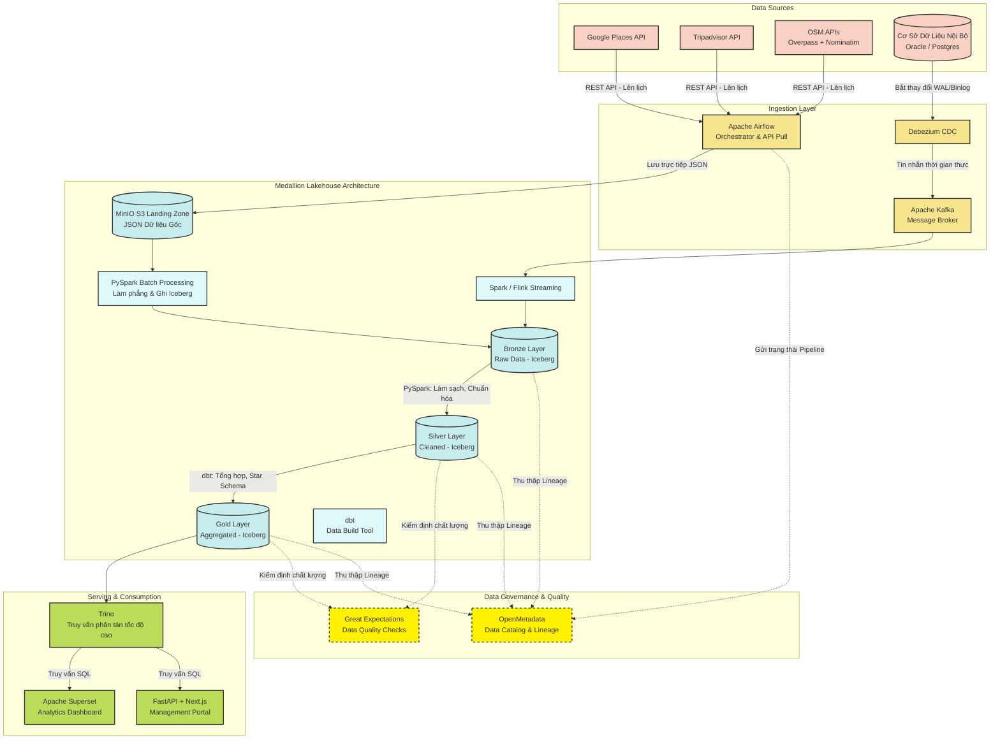

# Sơ đồ Kiến trúc Hệ thống

Dưới đây là sơ đồ kiến trúc tổng quan của nền tảng **Hanoi Smart Tourism Data Lakehouse Platform** dựa trên tài liệu mô tả dự án. Hệ thống được thiết kế theo mô hình **Medallion Architecture 3 lớp (Bronze - Silver - Gold)** kết hợp cả xử lý Batch và Streaming (Hybrid Ingestion).

### Thành phần chính

1. **Nguồn dữ liệu (Data Sources):** Dữ liệu thu thập từ API công khai thiết lập bằng cơ chế **Pull** và dữ liệu nội bộ qua cơ chế **Push (CDC)**. 
2. **Thu thập (Ingestion Layer):** Sử dụng chiến lược Hybrid: Batch (Airflow kéo API) và Streaming (Debezium + Kafka).
3. **Lưu trữ & Xử lý (Medallion Lakehouse):** Minh họa rõ quá trình dữ liệu đi từ MinIO Landing Zone, biến đổi phẳng hoá qua PySpark vào bảng Iceberg Bronze, làm sạch ở Silver và tổng hợp bằng dbt tại layer Gold.
4. **Tiêu thụ (Consumption):** Lớp Gold được truy vấn bởi Trino với tốc độ cực nhanh, từ đó trực quan trên Apache Superset và hiển thị trên Portal do Next.js phát triển.
5. **Quản trị & Chất lượng (Governance):** Song song với các layer xử lý, OpenMetadata tự động ghi nhận quá trình di chuyển của luồng dữ liệu (Lineage), còn Great Expectations thực thi bài kiểm tra về độ chuẩn xác của dữ liệu.
